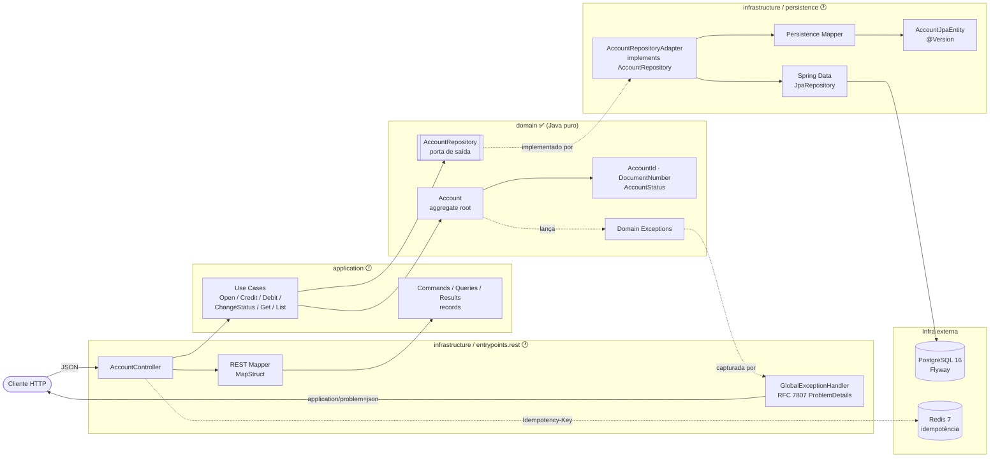
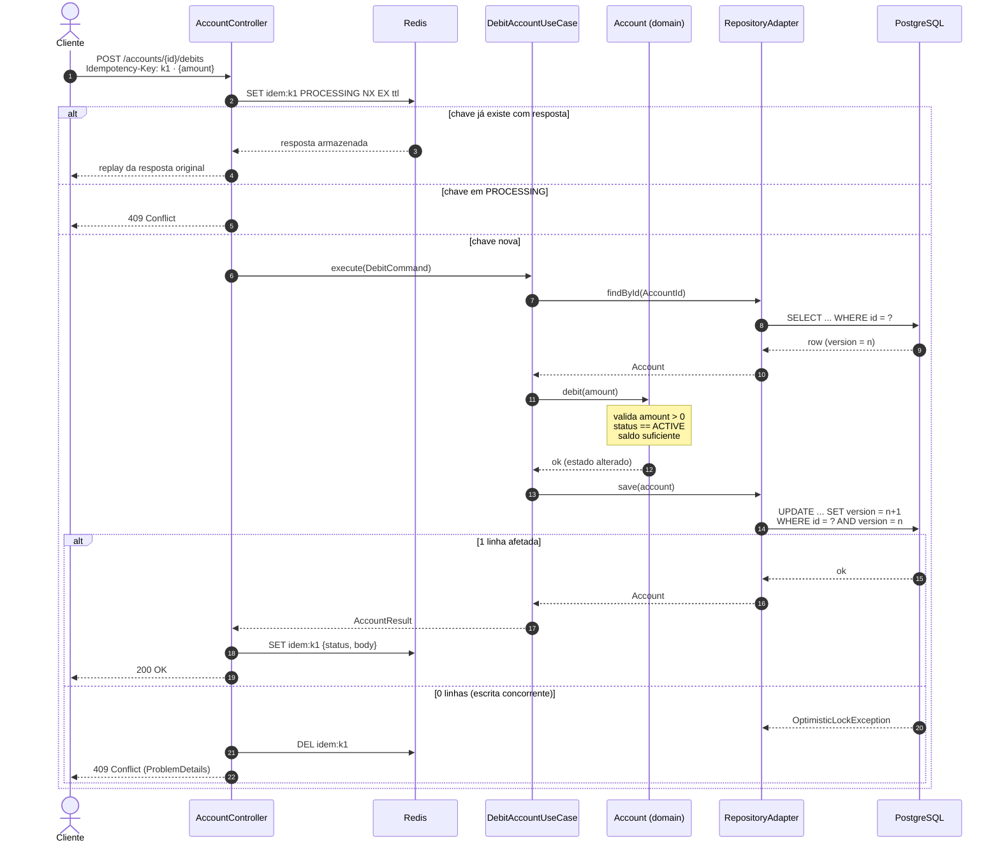
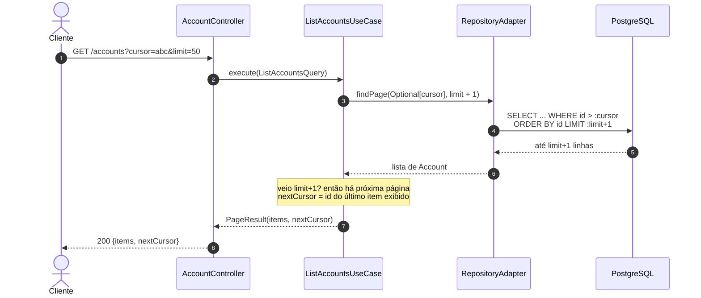
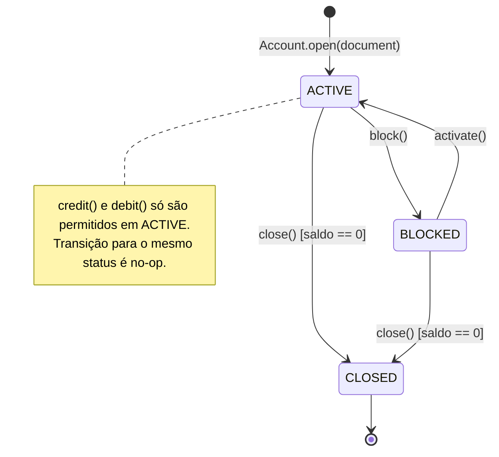

# Fluxo da Aplicação - Enterprise CRUD (Account)

Complementa o [RFC-001](RFC-001-architecture-and-schema.md). Os diagramas usam Mermaid (renderizado nativamente no GitHub/GitLab e no IntelliJ).

**Legenda de status:** ✅ implementado · 🕐 planejado (pacote ainda vazio). Nomes de endpoints e casos de uso marcados como 🕐 são **propostas**.

---

## 1. Visão geral das camadas (Hexagonal)

As dependências apontam sempre para dentro: `infrastructure → application → domain`. O `domain` não conhece Spring, JPA nem Redis.

---

## 2. Fluxo de mutação: débito com idempotência e lock otimista

Exemplo de ponta a ponta para `POST /accounts/{id}/debits` 🕐. Crédito, bloqueio e encerramento seguem o mesmo esqueleto e só trocam o método chamado no agregado.

---

## 3. Fluxo de consulta: listagem com paginação por cursor (keyset)

Sem `OFFSET/LIMIT`. O cursor é o último `id` da página anterior e é usado pelo `AccountRepository.findPage` ✅ (porta já definida).

---

## 4. Ciclo de vida da conta (regras em `AccountStatus` / `Account`) ✅

---

## 5. Mapeamento de erros → HTTP (GlobalExceptionHandler) 🕐

| Origem | Exceção | HTTP proposto |
|---|---|---|
| Domain | `InvalidAmountException` | 422 Unprocessable Content |
| Domain | `InvalidDocumentNumberException` | 422 Unprocessable Content |
| Domain | `InsufficientBalanceException` | 422 Unprocessable Content |
| Domain | `InvalidAccountStatusTransitionException` | 409 Conflict |
| Application | conta não encontrada | 404 Not Found |
| Application | documento já cadastrado | 409 Conflict |
| Infra | `OptimisticLockingFailureException` | 409 Conflict |
| Infra | Bean Validation (`@Valid`) | 400 Bad Request |

---

## 6. Ponto em aberto

**Versão controlada pelo domínio vs. JPA `@Version`.** Hoje `Account.touch()` incrementa `version` em memória. Se o adaptador copiar esse valor já incrementado para a entidade JPA, o Hibernate compara `n+1` com o `n` gravado no banco e lança `OptimisticLockException` em **toda** atualização. Há duas saídas:

1. O mapper grava na entidade a versão **lida** do banco e deixa o Hibernate incrementar.
2. O domínio deixa de incrementar e só carrega a versão.

Decidir antes de implementar `infrastructure/persistence`.
