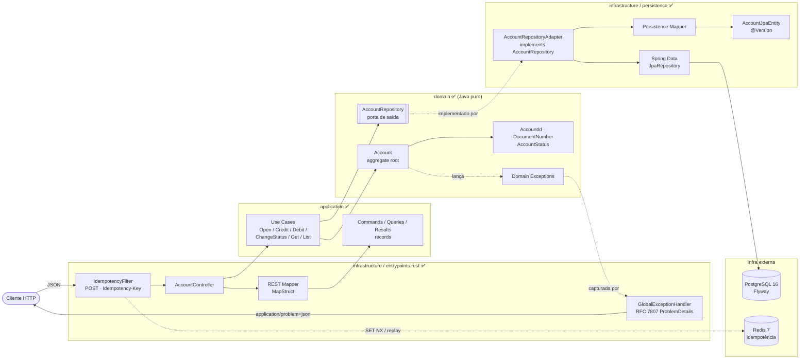
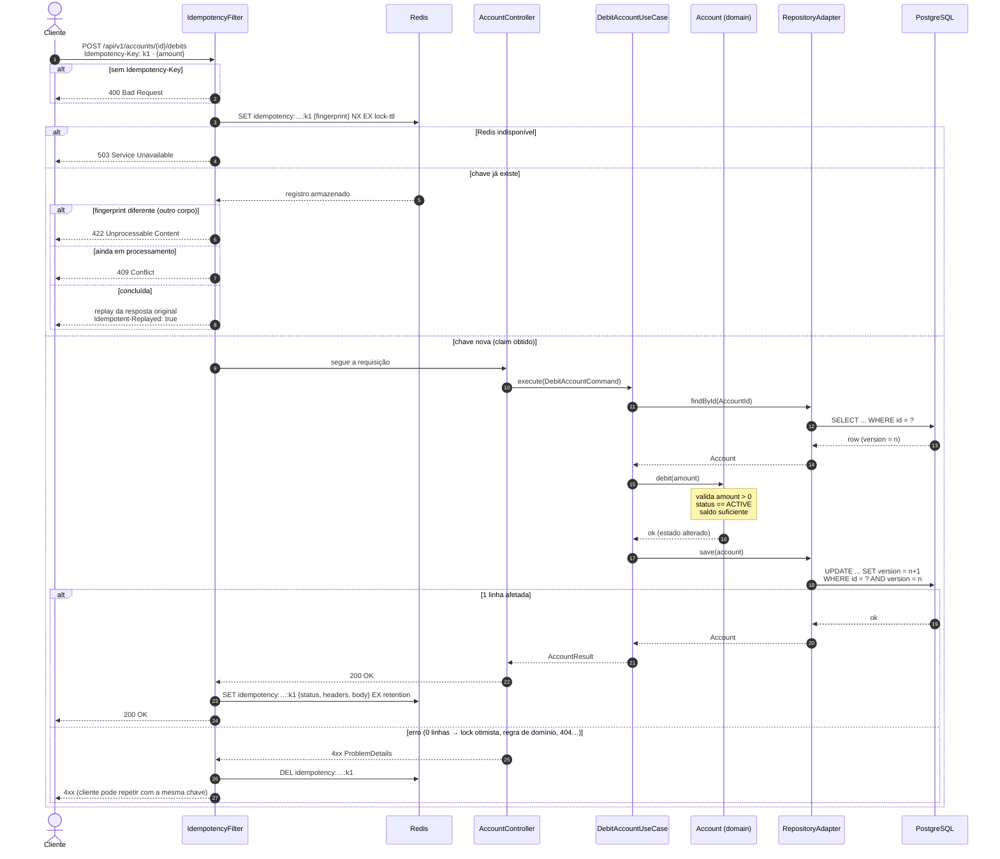
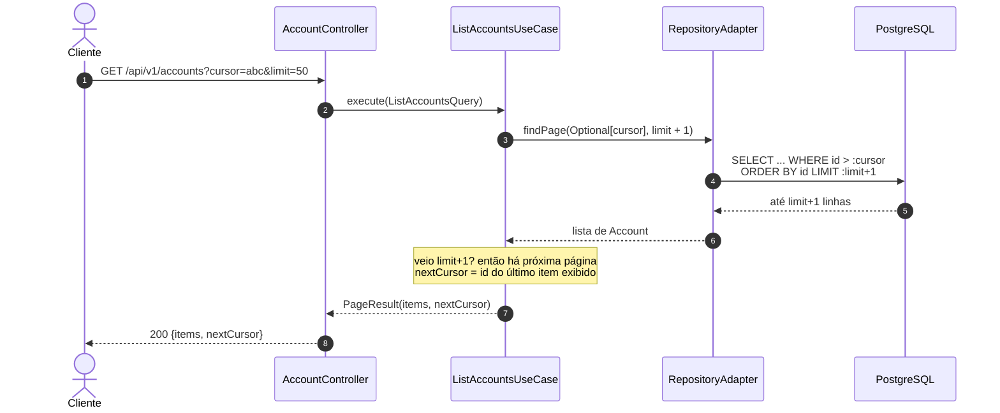
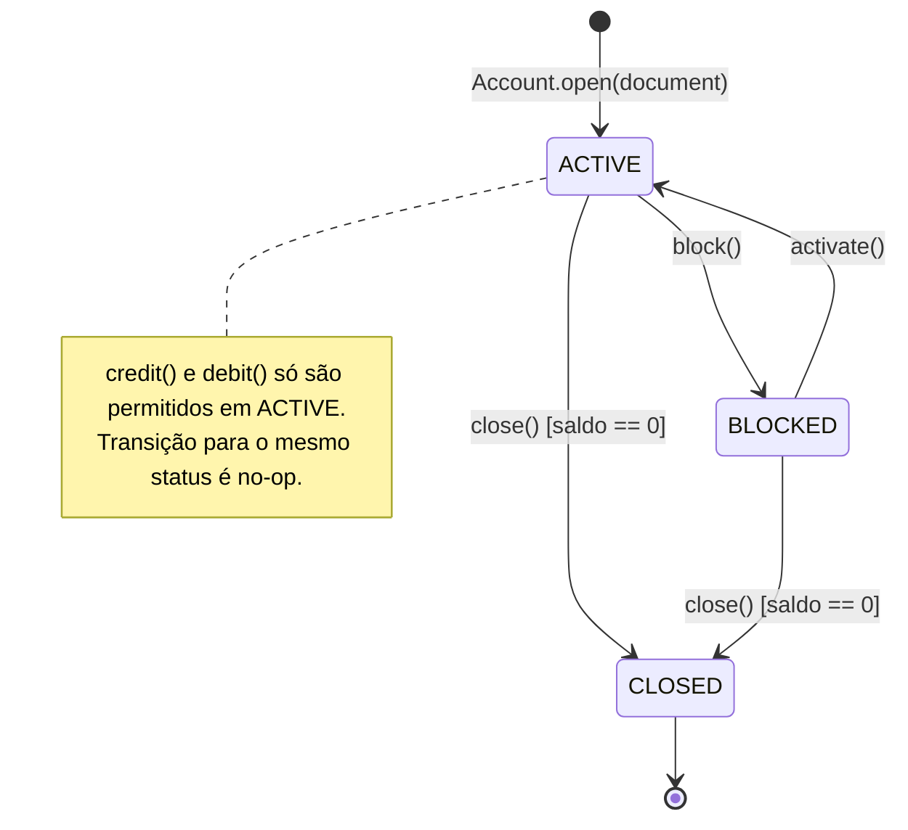
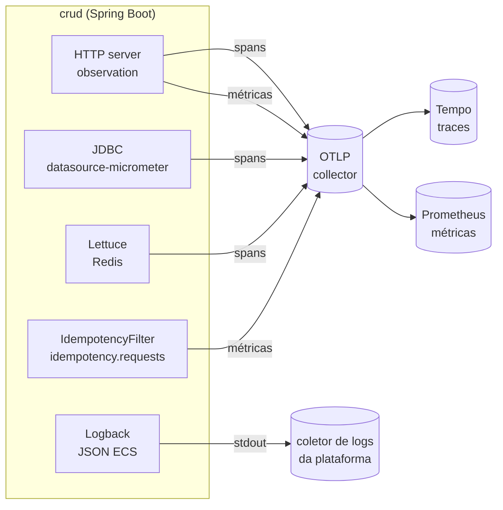

# Fluxo da Aplicação - Enterprise CRUD (Account)

Complementa o [RFC-001](RFC-001-architecture-and-schema.md). Os diagramas usam Mermaid (renderizado nativamente no GitHub/GitLab e no IntelliJ).

**Legenda de status:** ✅ implementado · 🕐 planejado (pacote ainda vazio). Nomes de endpoints e casos de uso marcados como 🕐 são **propostas**.

---

## 1. Visão geral das camadas (Hexagonal)

As dependências apontam sempre para dentro: `infrastructure → application → domain`. O `domain` não conhece Spring, JPA nem Redis.

---

## 1.1 Endpoints REST ✅

Respostas de erro em `application/problem+json` (RFC 9457), conforme a seção 5. Todo `POST` exige o header `Idempotency-Key` (seção 2).

| Método | Caminho | Corpo | Sucesso | Caso de uso |
|---|---|---|---|---|
| `POST` | `/api/v1/accounts` | `{"documentNumber"}` | 201 + `Location` | `OpenAccountUseCase` |
| `GET` | `/api/v1/accounts/{id}` | — | 200 | `GetAccountUseCase` |
| `GET` | `/api/v1/accounts?cursor=&limit=` | — | 200 `{items, nextCursor}` | `ListAccountsUseCase` |
| `POST` | `/api/v1/accounts/{id}/credits` | `{"amount"}` | 200 | `CreditAccountUseCase` |
| `POST` | `/api/v1/accounts/{id}/debits` | `{"amount"}` | 200 | `DebitAccountUseCase` |
| `PUT` | `/api/v1/accounts/{id}/status` | `{"status"}` | 200 | `ChangeAccountStatusUseCase` |

- **Versionamento:** a versão vem do segmento da URL (`/api/v1/...`), resolvida pelo versionamento nativo do Spring Framework 7 (`spring.mvc.apiversion.*` em `application.properties`). Versão não suportada (ex.: `/api/v2/...`) retorna 400. Para criar a v2: incluir `2` em `spring.mvc.apiversion.supported`, declarar `version = "2"` nos mapeamentos que mudarem e trocar os que não mudam para a baseline `"1+"` (atende v1 e v2). Com `version = "1"`, o mapeamento atende só a v1.
- `limit` padrão 20, máximo 100. `nextCursor` é `null` na última página.
- A mudança de status é `PUT` porque ir para o status atual é no-op no domínio, então a chamada é idempotente.
- A resposta traz `version`; um conflito de escrita concorrente retorna 409 e o cliente deve recarregar e tentar de novo.

---

## 2. Fluxo de mutação: débito com idempotência e lock otimista ✅

Exemplo de ponta a ponta para `POST /api/v1/accounts/{id}/debits`. Abertura e crédito seguem o mesmo esqueleto e só trocam o caso de uso; o `PUT /status` não passa pelo filtro porque já é idempotente.

Regras do `IdempotencyFilter` (segue o draft IETF do header `Idempotency-Key`):

- **Obrigatório em todo `POST` da API** (1 a 255 caracteres); sem ele → 400.
- **Escopo:** a chave vale por método + caminho (`idempotency:POST:/api/v1/accounts/{id}/debits:<key>`), e o corpo entra em uma impressão digital SHA-256.
- **Só respostas 2xx são guardadas** (status, `Location`, `Content-Type` e corpo) por `app.idempotency.retention` (24h) e repetidas com `Idempotent-Replayed: true`. Qualquer outra resposta libera a chave: uma mutação que falhou não deixou estado, então repetir é seguro. Isso cobre o 409 de lock otimista.
- **Claim em andamento** expira em `app.idempotency.lock-ttl` (30s), o que limita quanto tempo uma instância que caiu no meio da requisição bloqueia a chave.
- **Redis indisponível → 503**: a requisição é recusada em vez de arriscar aplicar a mutação duas vezes.

---

## 3. Fluxo de consulta: listagem com paginação por cursor (keyset)

Sem `OFFSET/LIMIT`. O cursor é o último `id` da página anterior e é usado pelo `AccountRepository.findPage` ✅ (porta já definida).

---

## 4. Ciclo de vida da conta (regras em `AccountStatus` / `Account`) ✅

---

## 5. Mapeamento de erros → HTTP (GlobalExceptionHandler) ✅

| Origem | Exceção | HTTP |
|---|---|---|
| Domain | `InvalidAmountException` | 422 Unprocessable Content |
| Domain | `InvalidDocumentNumberException` | 422 Unprocessable Content |
| Domain | `InsufficientBalanceException` | 422 Unprocessable Content |
| Domain | `InvalidAccountStatusTransitionException` (inclui crédito/débito fora de `ACTIVE`) | 409 Conflict |
| Application | conta não encontrada | 404 Not Found |
| Application | documento já cadastrado | 409 Conflict |
| Infra | `OptimisticLockingFailureException` | 409 Conflict |
| Idempotência | `POST` sem `Idempotency-Key` | 400 Bad Request |
| Idempotência | mesma chave, requisição ainda em processamento | 409 Conflict |
| Idempotência | mesma chave com corpo diferente | 422 Unprocessable Content |
| Idempotência | Redis indisponível | 503 Service Unavailable |
| Infra | Bean Validation (`@Valid`, `limit` fora de 1..100), JSON malformado, UUID/enum inválido | 400 Bad Request |

---

## 6. Decisão: versão do agregado × JPA `@Version`

**Decidido: o domínio só carrega a versão.** `Account` guarda a versão lida do banco e nunca a incrementa; `touch()` atualiza apenas `updatedAt`. O incremento é responsabilidade da persistência (`@Version` no Hibernate), então o `UPDATE ... WHERE version = n` compara sempre com o valor efetivamente lido e uma escrita concorrente vira `OptimisticLockException` → 409.

---

## 7. Observabilidade ✅

Os três pilares do RFC-001 (métricas RED, tracing distribuído e logs estruturados) usam Micrometer e OpenTelemetry via `spring-boot-starter-opentelemetry`. Tudo sai em OTLP, então qualquer backend compatível serve.

| Pilar | O que existe | Onde configurar |
|---|---|---|
| **Métricas RED** | `http.server.requests` por rota, método e status (taxa, erros, latência), com buckets de histograma para p95/p99. Também métricas de Hikari, JVM e Lettuce. | `management.otlp.metrics.export.*` (desligado por padrão) |
| **Idempotência** | `idempotency.requests{outcome}`: `executed`, `replayed`, `released`, `mismatch`, `in_progress`, `missing_key`, `unavailable`. | automático |
| **Tracing** | Um trace por requisição, com spans do servidor HTTP, das consultas SQL (`connection`, `query`, `result-set`) e dos comandos Redis. Os spans SQL **não** incluem valores de parâmetros (o documento é dado pessoal). Propagação W3C `traceparent`. | `management.opentelemetry.tracing.export.otlp.endpoint` (vazio por padrão), amostragem de 10% (`management.tracing.sampling.probability`) |
| **Trace id para o cliente** | Toda resposta de `/api/*` traz `X-Trace-Id`, inclusive os erros gerados pelos filtros. | `ObservabilityConfiguration` |
| **Logs** | Na imagem Docker, JSON no formato ECS com `traceId`, `spanId`, `service.name` e `service.version`. Fora do container, texto comum. | `LOGGING_STRUCTURED_FORMAT_CONSOLE` |

**Sem coletor, nada é exportado:** o endpoint de traces é vazio e a exportação de métricas está desligada em `application.properties`, então a stack padrão não gera erros de conexão no log. O `docker-compose.observability.yml` liga as duas coisas, com amostragem de 100%, apontando para o `grafana/otel-lgtm` (ver `CONTRIBUTING.md`).

**Limitação conhecida:** respostas produzidas pelos filtros (replay de idempotência e 400/409/422/503) não chegam a um controller, então aparecem em `http.server.requests` com `uri=UNKNOWN`. Para esses casos, use `idempotency.requests`, que tem o desfecho exato.
